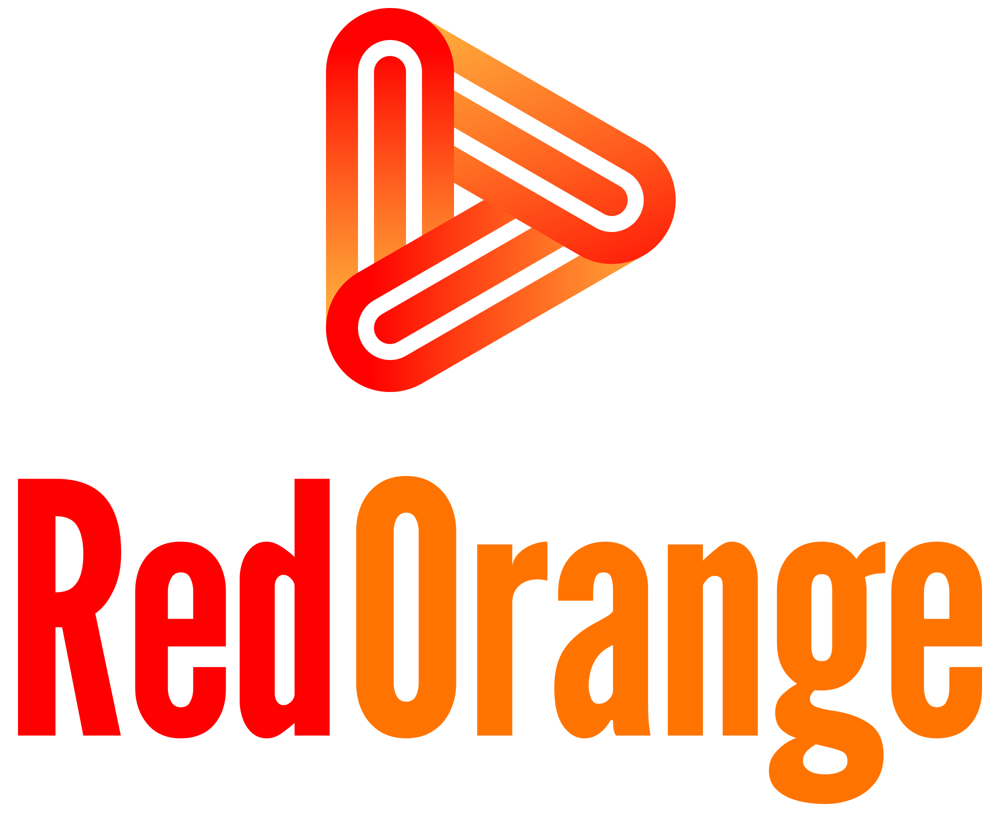

  

<h1 align="center">👋 Hi, I'm Daniel D Fortuna</h1>
<h3 align="center">💼 Odoo Developer | 🧑‍💻 Fullstack Engineer | 🚀 Tech Enthusiast</h3>

  

---

### 🌟 About Me
I'm a **Software Developer & ERP Specialist** passionate about building scalable business applications — from backend automation in **Odoo** to full-featured web apps using **Laravel**, **Node.js**, and **AdonisJS**.  
I help businesses streamline operations and enhance productivity through modern, efficient digital systems.

- 🧩 Specializing in **Odoo Development**, **ERP Customization**, and **Integration**  
- ⚙️ Skilled in **Python**, **PostgreSQL**, **Docker**, **REST APIs**, and **Microservices**  
- 💡 Exploring **AI-driven ERP** and **Cross-platform App Development (Flutter)**  
- 🚀 Currently building tools under the **RedOrange** brand to simplify ERP workflows  

---

### 🛠️ Tech Stack

#### 💜 Core Expertise

  
  
  
  

#### 💻 Fullstack Tools

  
  
  
  

---

### 📊 GitHub Stats

  
  

  

---

### 🧠 Currently Working On
- 🧾 **Custom Odoo Modules** for HR, Accounting, and Manufacturing  
- 🧰 **Integration Projects** between Odoo & third-party web services  
- 💡 Building internal tools under **RedOrange** for faster ERP deployment  

---

### 🌐 Connect With Me

  
  
  
  

---

  <i>“Turning business complexity into elegant digital systems.”</i> 
  <b>— RedOrange</b> 🍊

